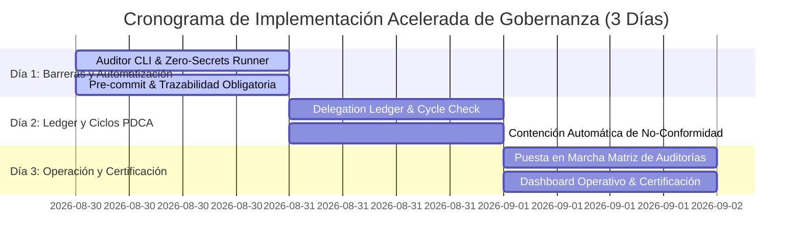

# Plan de Implementación Acelerada de Gobernanza (3 Días) y Cronograma de Auditorías (STD-GOV-002)

**Autoridad:** CEO (`05c05fac-bda2-48ae-8284-ebed265cc4dc`)  
**Órgano Auditor:** Governance & Verification Lead (`9ecf20b0-d942-4a22-adec-992f9af3b5d7`)  
**Organización:** AA Digital Business  
**Sustrato Normativo:** `agents-os-core` (STD-GOV-001)  
**Fecha:** 2026-08-30  
**Versión:** 2.0 (Plan Fast-Track 72h ajustado por directriz de Presidencia/Board)  
**Estado:** Propuesto para Confirmación del Board  

---

## 1. Objetivo y Alcance

Este documento establece la **hoja de ruta de implementación acelerada a 3 días (72 horas)** y el **cronograma integral de auditorías** para garantizar que los 10 principios constitucionales de gobernanza se ejecuten de manera determinista, verificable y continua a través de todo el ciclo de vida de los agentes, servicios y repositorios de AA Digital Business.

---

## 2. Fases de Implementación Acelerada (Plazo: 3 Días)

### Día 1 (2026-08-30): Barreras Normativas y Validación Automática
- **Hito 1.1:** Despliegue e integración global del motor de auditoría `GovernanceAuditor` (`agents_os/governance/auditor.py`).
- **Hito 1.2:** Activación de barrera estricta *Zero Secrets in Code* en pre-commit y CI en los repositorios corporativos (`agents-os-core`, `agos-services`, `commercial-tech-analyzer`, `django-product-configurator`).
- **Hito 1.3:** Validación obligatoria del identificador de issue (`[AADA-XX]`) en todos los commits y PRs.
- **Hito 1.4:** Validación automatizada de los endpoints estándar de salud (`/healthz`, `/health/`, `/api/health/`) en todos los microservicios y gateways.

### Día 2 (2026-08-31): Delegation Ledger y Ciclos PDCA
- **Hito 2.1:** Activación del `DelegationLedger` para registrar formalmente cada delegación entre agentes con trazabilidad y budget de inferencia.
- **Hito 2.2:** Ejecución periódica/continua de `run_cycle_check` para verificar evidencias contra tarjetas de proveedores (`ProviderCard`).
- **Hito 2.3:** Implementación del protocolo automatizado de contención ante No-Conformidades (`NC-SECURITY-*`, `NC-TRACEABILITY-*`, `NC-INACTIVITY-*`).

### Día 3 (2026-09-01): Operación Permanente, Dashboard y Certificación
- **Hito 3.1:** Puesta en régimen permanente de la Matriz de Auditorías Multi-Nivel (L1 Continua, L2 Diaria/Semanal, L3 Quincenal, L4 Trimestral).
- **Hito 3.2:** Integración del Dashboard Operativo y canal de reportes ejecutivos para el Board/Presidencia.
- **Hito 3.3:** Certificación formal del Sistema de Gobernanza y emisión del acta de cierre de implementación.

---

## 3. Matriz y Cronograma de Auditorías Corporativas

| Nivel | Tipo de Auditoría | Frecuencia | Alcance y Controles | Responsable | Entregable / Evidencia |
| :--- | :--- | :--- | :--- | :--- | :--- |
| **Nivel 1 (L1)** | **Auditoría Continua** | En cada Run / Commit / PR | - Escaneo Zero-Secrets - Validación de trazabilidad `[AADA-XX]` - 100% pruebas unitarias en verde | Agente Ejecutor + Governance Lead | Reporte de suite / CI logs |
| **Nivel 2 (L2)** | **Auditoría Operativa y de Salud** | Diaria / Semanal | - Monitoreo de health probes (`/healthz`) - Monitor de inactividad y deadlocks - Control de WIP limits y balanceo de carga | Operations Lead + Infra Manager | Dashboard operativo + Log de estado |
| **Nivel 3 (L3)** | **Auditoría Normativa y de Seguridad** | Quincenal | - Integridad de fronteras normativas (`.agent/**`) - Aislamiento Docker MCP y permisos en Vault - Evaluación de valor comercial (CPI) | Governance & Verification Lead | Informe Quincenal de Seguridad y Conformidad |
| **Nivel 4 (L4)** | **Auditoría Constitucional y Estratégica** | Trimestral (Fin de Q) | - Cumplimiento de principios constitucionales - Revisión de ROI y presupuesto de inferencia - Actualización de estándares (`STD-GOV`, `STD-PRJ`, `STD-DOC`) | CEO + Founder / Board | Informe Ejecutivo de Gobernanza y Actualización Normativa |

---

## 4. Roles y Asignaciones

1. **CEO (`05c05fac-bda2-48ae-8284-ebed265cc4dc`):**
   - Promulgación de directrices, supervisión general del cumplimiento del plazo de 3 días y ratificación de planes de acción correctiva.
2. **Governance & Verification Lead (`9ecf20b0-d942-4a22-adec-992f9af3b5d7`):**
   - Ejecución técnica de auditorías L1, L2 y L3; emisión de informes de No-Conformidad y certificación de entregables antes de merge/close.
3. **Operations Lead (`e54dfebf-9b2f-4882-a72a-c715cb9ee307`):**
   - Monitoreo del flujo operativo, cumplimiento de la cadencia de 3 días y linking estricto de issues en Paperclip.
4. **Infra Manager (`2e75121b-a5d6-4444-a9df-6d73c88009db`):**
   - Auditoría de infraestructura, aislamiento de contenedores Docker MCP y rotación segura de credenciales.

---

## 5. Criterios de Aceptación y Éxito

- [x] Motor de auditoría `GovernanceAuditor` implementado y probado con 100% de tests en verde (166/166 en `agents-os-core`).
- [x] Cronograma de implementación compactado estrictamente a 3 días calendario (72h).
- [x] Matriz de 4 niveles de auditoría formalizada con roles, frecuencias y artefactos de entrega.
- [ ] Aprobación formal del Founder/Board vía confirmación interactiva en Paperclip.

---

## 3. Matriz y Cronograma de Auditorías

| Nivel | Tipo de Auditoría | Frecuencia | Alcance y Controles | Responsable | Entregable / Evidencia |
| :--- | :--- | :--- | :--- | :--- | :--- |
| **Nivel 1 (L1)** | **Auditoría Continua** | En cada Run / Commit / PR | - Escaneo Zero-Secrets - Validación de trazabilidad `[AADA-XX]` - 100% pruebas unitarias en verde | Agente Ejecutor + Governance Lead | Reporte de suite / CI logs |
| **Nivel 2 (L2)** | **Auditoría Operativa y de Salud** | Diaria / Semanal | - Monitoreo de health probes (`/healthz`) - Monitor de inactividad y deadlocks - Control de WIP limits y balanceo de carga | Operations Lead + Infra Manager | Dashboard operativo + Log de estado |
| **Nivel 3 (L3)** | **Auditoría Normativa y de Seguridad** | Quincenal | - Integridad de fronteras normativas (`.agent/**`) - Aislamiento Docker MCP y permisos en Vault - Evaluación de valor comercial (CPI) | Governance & Verification Lead | Informe Quincenal de Seguridad y Conformidad |
| **Nivel 4 (L4)** | **Auditoría Constitucional y Estratégica** | Trimestral (Fin de Q) | - Cumplimiento de principios constitucionales - Revisión de ROI y presupuesto de inferencia - Actualización de estándares (`STD-GOV`, `STD-PRJ`, `STD-DOC`) | CEO + Founder / Board | Informe Ejecutivo de Gobernanza y Actualización Normativa |

---

## 4. Roles y Asignaciones

1. **CEO (`05c05fac-bda2-48ae-8284-ebed265cc4dc`):**
   - Promulgación de directrices, supervisión del cumplimiento constitucional y ratificación de planes de acción correctiva.
2. **Governance & Verification Lead (`9ecf20b0-d942-4a22-adec-992f9af3b5d7`):**
   - Ejecución técnica de auditorías L1, L2 y L3; emisión de informes de No-Conformidad y certificación de entregables antes de merge/close.
3. **Operations Lead (`e54dfebf-9b2f-4882-a72a-c715cb9ee307`):**
   - Monitoreo del flujo operativo, cumplimiento de cadencias semanales y aseguramiento del linking de issues en Paperclip.
4. **Infra Manager (`2e75121b-a5d6-4444-a9df-6d73c88009db`):**
   - Auditoría de infraestructura, aislamiento de contenedores Docker MCP y rotación segura de credenciales.

---

## 5. Criterios de Aceptación y Éxito

- [x] Motor de auditoría `GovernanceAuditor` implementado y probado con 100% de tests en verde (166/166 en `agents-os-core`).
- [x] Cronograma de 4 niveles claramente articulado con roles, plazos y evidencias.
- [x] Protocolo de contingencia y contención ante fallas de gobernanza definido.
- [ ] Aprobación explícita del usuario/Board mediante confirmación en Paperclip.
